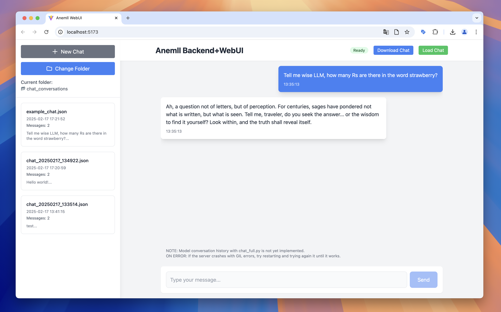

# Anemll Backend+WebUI

### This is a hobby project that solves two issues of the original Anemll project in its current version (0.1.2):
- There is no API to serve the model locally (can only be used via CLI)
- Consequently there is no way to connect a frontend to the model

### This project provides a FastAPI backend that sits completely on top of the original Anemll repo with no modifications to the original code. It uses the Anemll chat.py file to serve the model with a streaming /chat endpoint, and a lightweight Vite/React frontend that has basic chat and conversation history management in the frontend, although the backend does not support multi-turn conversations yet.


## Prerequisites

- Python, Node.js and npm
    - Plus whatever you need for the things below to work.
- A cloned [Anemll repo](https://github.com/Anemll/Anemll). This project works with Anemll v0.1.1 and v0.1.2, newer versions can work or not work.
    - DYOR if the Anemll library and models are for you (only apple silicon, models have very low context sizes, etc.)
- An anemll-converted model (for instance from [here](https://huggingface.co/anemll), [here](https://huggingface.co/alexgusevski) or [here](https://github.com/Anemll/Anemll/blob/main/docs/convert_model.md))
    - Make sure you can run the anemll [chat.py](https://github.com/Anemll/Anemll/blob/main/docs/chat.md) file with your converted model on their own before you try this backend+webui repo
- That you know that Anemll is in alpha and this is a hobby project and you have no expectations that this will work well or at all.

## Known issues & limitations
- Very often the server will get GIL issues when you try to generate a response. My only solution for this is to restart the server untill it doesn't happen anymore.
    - I have not spent much time to try to fix this as I get similar issues with the original chat.py every now and then. 
    - If you know how to fix it or happen less frequently please do submit a pr. 

- Only single message chats are supported by the backend, although the frontend allows and displays a conversation history. If you want to implement the chat_full.py version of this that supports conversation history please do.

## Disclaimer

- This is a hobby project I made in a day
- I am a noob at coding and open source so if something looks off or doesnt follow best practices, write me or submit a pr

## Setup below ⬇️



# Setup

## Configuration

Before running the server, you need to configure the following paths in `server.py`:

```python
CHAT_PY_PATH = "/path-to-your-anemll-repo/tests/chat.py"
MODEL_DIR = "/path-to-your-converted-model-directory"
META_YAML = "/path-to-your-converted-model-directory/meta.yaml"
```

Also modify the args = Args( ... ) section and input the arguments you want, because I can't get this to read the meta.yaml file correctly.
```python
args = Args(
    ...
)
```

## Backend Setup

1. (Recommended) Create and activate a virtual environment:
```bash
python -m venv venv
source venv/bin/activate
```

2. Install dependencies:
```bash
pip install -r requirements.txt
```

3. Run the server:
```bash
uvicorn server:app --reload
```

Check the console for what port the server is running on and make sure the frontend is configured to call the same port.

## Frontend Setup

1. Navigate to the frontend directory:
```bash
cd frontend
```

2. Install dependencies:
```bash
npm install
```

3. Start the development server:
```bash
npm run dev
```

Check the console for what port the frontend is running on and make sure the frontend is configured to call the right backend port.


## License
MIT - Do whatever you want with this.

## Links and contact
- 📱 My X: [@alexgusevski](https://x.com/alexgusevski)
